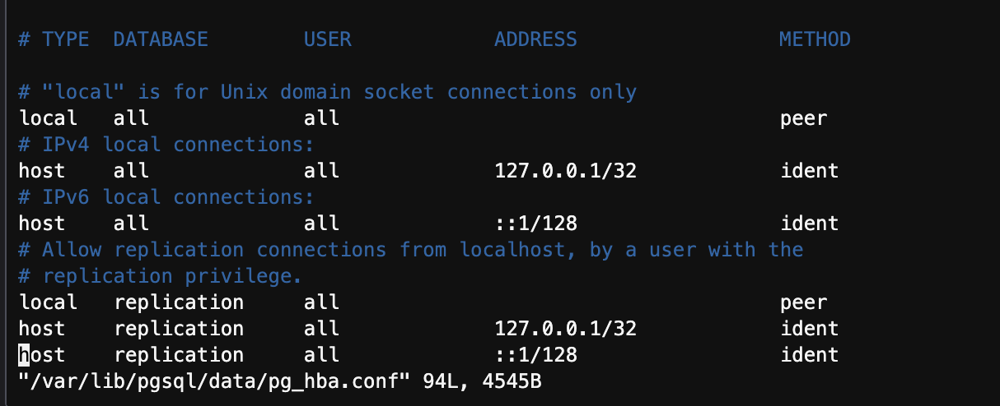

### Preparation
- install dependency(Node version: v18.16.0):
	- `npm install`

### Step 1:  Install & Configure PostgreSQL
[Reference link](https://medium.com/@sanketgawali531/how-to-install-configure-postgresql-on-amazon-linux-8f39329d0f8e)

---

### Step 2: Create database: `content_dev`

---
### Step 3: Execute migrations:

QAs:
QA1: Error: Ident authentication failed for user "web_server"

**update pg_hba.conf file**
before:

after:

**restart Postgres after updating the `pg_hba.conf` file**
`sudo systemctl restart postgresql `

QA2: QueryFailedError: function uuid_generate_v4() does not exist

Solution:
`sudo yum install postgresql15-contrib`

---

### Step 4: Start the service and reproduce the issue:
`npm run content:run`

